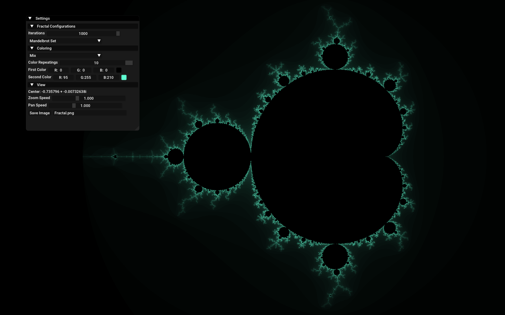

# fractal-viewer

A fractal exploration tool powered by [SFML](https://www.sfml-dev.org) and GLSL for GPU acceleration, offering real-time rendering, zooming, panning, and color adjustment capabilities to ensure seamless performance. Additionally, it utilizes [ImGui](https://github.com/ocornut/imgui) for intuitive user interactions, all implemented in C++.

## Features

* Real Time Pan and Zoom:
  * Use WASD to pan around.
  * Use <kbd>↑</kbd> and <kbd>↓</kbd> to zoom in and out respectively.
* Color Adjustment - Choose from 3 modes:
  * Grayscale - Renders the fractal from black to white.
  * Mix - Renders the fractal with a blend of two colors.
  * Rainbow - Renders the fractal with a rainbow color scheme.
* Saving - Easily save a screenshot of the fractal locally.

## Screenshots

    
    
    
    
    
    

